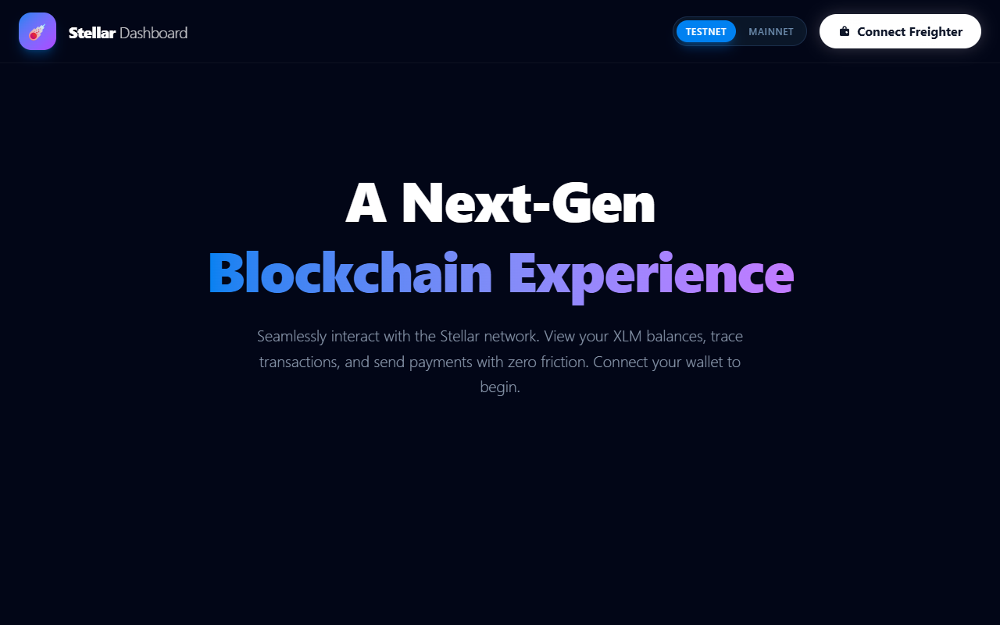

# 🌟 Stellar Payment Dashboard

A **Level 3 Orange Belt** mini-dApp submission for a blockchain hackathon. A full-featured, non-custodial XLM payment dashboard built with React + Vite, connected to the Stellar blockchain via the Freighter wallet extension.

## 🔗 Live Demo

> **[https://stellar-pay-dashboard.vercel.app/](https://stellar-pay-dashboard.vercel.app/)** — Deployed onto Vercel!

## 📸 Screenshot




## 🎬 Demo Video

> **[https://youtu.be/JLYxES5ZWSM]**

---

## ✨ Features

- **🦊 Freighter Wallet Integration** — Connect/disconnect with Freighter, persists session in localStorage
- **💰 XLM Balance Display** — Real-time balance with 30-second TTL cache and skeleton loaders
- **🚀 Send XLM** — Full 4-step progress flow: Validate → Sign → Submit → Confirmed
- **📋 Transaction History** — Last 10 payments, direction (sent/received), amount, counterparty, links to Stellar Expert
- **🔀 Network Toggle** — Switch between Testnet and Mainnet with confirmation modal
- **🍞 Toast Notifications** — Success/error/warning messages for all async actions
- **🌌 Cosmic Dark UI** — Space aesthetic with animated star field and glow effects

---

## 🛠 Tech Stack

| Layer | Technology |
|---|---|
| Framework | React 19 + Vite 8 |
| Blockchain | stellar-sdk + Stellar Horizon API |
| Wallet | @stellar/freighter-api |
| Styling | Tailwind CSS v4 |
| Testing | Vitest + @testing-library/react + jsdom |
| Deployment | Vercel |

---

## 🚀 Getting Started

```bash
git clone <your-repo-url>
cd stellar-payment-dashboard
npm install
npm run dev
```

Open [http://localhost:5173](http://localhost:5173) in your browser.

**Prerequisites:** Install the [Freighter wallet extension](https://www.freighter.app/) and create/fund a testnet account via [Stellar Laboratory](https://laboratory.stellar.org/).

---

## 🧪 Running Tests

```bash
npm test
```

All test suites must pass:

```
✓ src/tests/cache.test.js (4 tests)
✓ src/tests/stellar.test.js (8 tests)
✓ src/tests/SendForm.test.jsx (5 tests)
```

### Test Coverage

```bash
npm run coverage
```

---

## 🏗 Architecture

### Caching Strategy

Two-level caching using `localStorage` with TTL:

| Data | Cache Key | TTL |
|---|---|---|
| XLM Balance | `balance_{network}_{address}` | 30 seconds |
| Transaction History | `txns_{network}_{address}` | 60 seconds |
| Wallet Address | `stellar_wallet_address` | Persistent |

The `cache.js` utility stores `{ value, expiry }` objects and auto-evicts stale entries on read.

### Send XLM Progress States

```
Step 1: Validating   → Validates fields + address format locally
Step 2: Signing      → Freighter extension signs the XDR transaction
Step 3: Submitting   → Transaction broadcast to Horizon API
Step 4: Confirmed ✅  → Success with transaction hash link
```

### Component Architecture

```
App.jsx
├── Header
│   ├── NetworkToggle     ← testnet/mainnet + warning modal
│   └── WalletConnect     ← Freighter connection + address display
├── BalanceCard           ← XLM balance + skeleton + refresh
├── SendForm              ← Validated form + ProgressStepper
├── TransactionHistory    ← Last 10 payments + empty state
└── Toast                 ← Global notification system
```

---

## ☁️ Deployment (Vercel)

1. Push your code to GitHub
2. Go to [vercel.com](https://vercel.com) and import the repository
3. Set **Framework Preset** to `Vite`
4. Set **Root Directory** to `stellar-payment-dashboard` (if in a monorepo)
5. Add any required environment variables (none by default for testnet)
6. Click **Deploy** 🎉

Update the `Live Demo` link above with your Vercel URL.

---

## 📄 License

MIT
